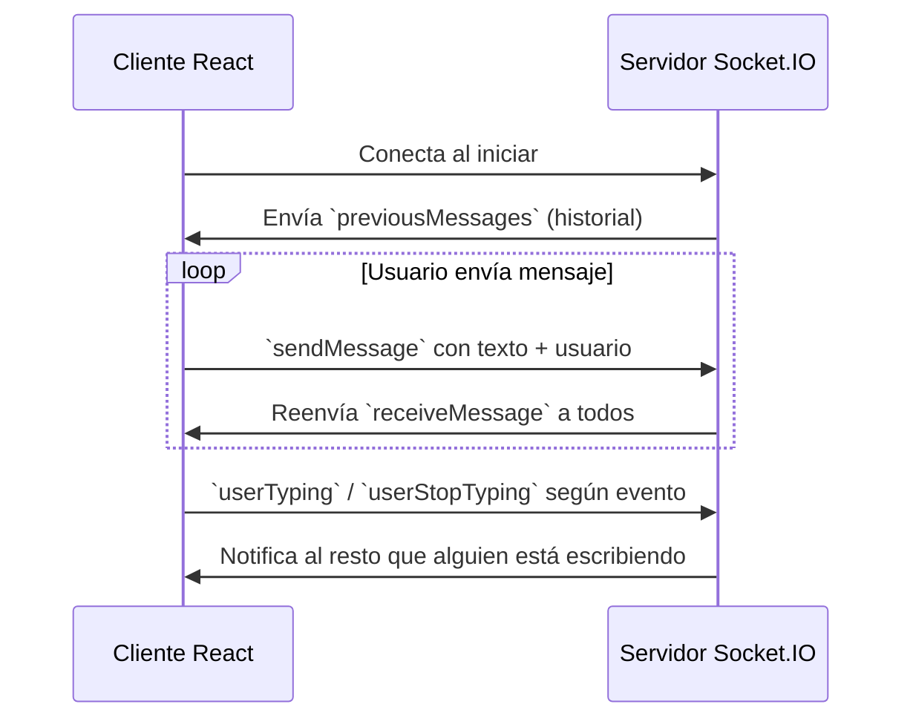

# 📱 Chat-Frontend — Cliente Web en Tiempo Real

**Chat-Frontend** es una aplicación **React + Vite** que sirve como cliente para un chat global en tiempo real.  
La interfaz se conecta a un servidor Socket.IO, permite autenticación simple por nombre de usuario, muestra mensajes históricos, notifica cuando alguien está escribiendo y ofrece experiencia responsive gracias a Tailwind CSS.

---

## 🧩 Arquitectura del Proyecto

```bash
📦 chat-frontend
├── public/                    # Archivos estáticos (favicon, index.html)
├── src/                       # Código fuente React
│   ├── App.jsx                # Componente raíz y lógica principal
│   ├── main.jsx               # Punto de entrada de Vite/React
│   ├── index.css              # Estilos globales
│   ├── App.css                # Estilos de la aplicación
│   ├── assets/                # Imágenes o recursos estáticos
│   └── components/            # Componentes funcionales
│       ├── Login.jsx          # Formulario de inicio de sesión por usuario
│       ├── ChatContainer.jsx  # Lista de mensajes y scroll automático
│       └── MessageInput.jsx   # Campo de texto con manejo de "typing"
├── package.json               # Dependencias y scripts
├── vite.config.js             # Configuración de Vite (alias, env)
├── tailwind.config.js         # Configuración de TailwindCSS
├── postcss.config.js          # PostCSS para Tailwind
├── eslint.config.js           # Reglas de linting
└── README.md                  # Documentación del proyecto
```

---

## ⚙️ Tecnologías Principales

| Tipo        | Tecnología                    |
|-------------|-------------------------------|
| **Framework** | React (v18) + Vite            |
| **Estilos** | Tailwind CSS                 |
| **Tiempo real** | Socket.IO-client              |
| **Gestión de estado** | React Hooks (useState/useEffect) |
| **Variables de entorno** | Vite (`import.meta.env`) + dotenv |
| **Linting** | ESLint con configuración personalizada |

---

## 🚀 Características Principales

### 🔐 Autenticación ligera
- Usuario sólo proporciona un nombre.  
- El nombre se guarda en `localStorage` para persistir sesión.
- Opción de cerrar sesión y limpiar el almacenamiento.

### 💬 Chat en tiempo real
- Conexión a un servidor Socket.IO especificado en `VITE_API_URL`.
- Recepción de mensajes previos desplegados al cargar.
- Emisión de nuevos mensajes con marca de tiempo local.
- Visualización diferenciada del remitente actual.

### ✍️ Indicador de escritura
- Se notifica en la UI cuando otro usuario está tecleando.
- Se emiten eventos `userTyping` y `userStopTyping` para sincronizar.

### 🛠️ Experiencia de cliente
- UI responsiva con contenedor centrado y tema oscuro.
- Barra de estado fija con nombre de usuario y botón de logout.
- Efectos de animación sutiles en indicadores de escritura.

---

## 🧠 Flujo General del Cliente



---

## 🧰 Instalación y Configuración

```bash
# 1️⃣ Clona el repositorio
git clone https://github.com/Angelitoo777/chat_frontend.git
cd chat-frontend

# 2️⃣ Instala dependencias
npm install

# 3️⃣ Variables de entorno
cp .env.example .env                    # si existe
# o crea .env con:
# VITE_API_URL=http://localhost:3000

# 4️⃣ Ejecuta en modo desarrollo
npm run dev
```

> La aplicación necesita un servidor Socket.IO corriendo (por ejemplo el backend `chat-backend`) escuchando en la URL configurada.

---

## 📋 Scripts Útiles

- `npm run dev` – inicia el servidor de desarrollo de Vite.
- `npm run build` – construye la versión de producción en `dist/`.
- `npm run preview` – sirve la compilación de producción localmente.
- `npm run lint` – ejecuta ESLint en los archivos fuente.

---

## 📁 Estructura de Componentes

| Componente         | Propósito                              |
|--------------------|----------------------------------------|
| `Login`            | Captura y guarda el nombre de usuario  |
| `ChatContainer`    | Muestra los mensajes y autoscroll       |
| `MessageInput`     | Entrada de texto y detección de typing |

---

## 👨‍💻 Autor

**Angel Oropeza**  
**Stack:** React, Vite, Tailwind, Socket.IO  
**Proyecto:** Chat en tiempo real con interfaz ligera 🚀

